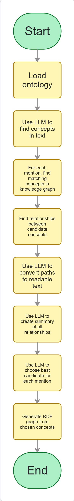
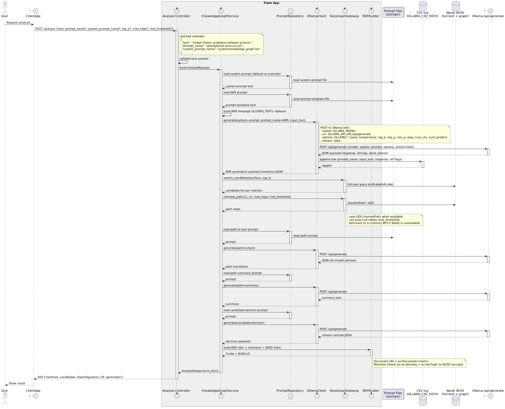

# Hybrid Pipeline Knowledge Graph Construction API

Flask API that turns free text (e.g., paper abstracts) into a SKOS-aligned RDF knowledge graph using a hybrid pipeline:
1) **LLM-based NER** (JSON mentions with offsets)
2) **Candidate selection** via Neo4j full-text search over SKOS/ACM CCS
3) **Candidate disambiguation** using shortest paths -> path-to-text -> summarization -> LLM decision
4) **RDF materialization** (Turtle + JSON-LD) with document/mention nodes and SKOS links

## Process Flow



## Project Layout
- `src/` — Flask app (DDD-ish layering: controllers/application/domain/infrastructure)
- `prompt/` — system + step-specific prompts (NER, path translation, summary, decision)
- `scripts/` — ACM CCS SKOS import + full-text index creation
- `tests/` — unit, controller, and integration coverage

## Running
```bash
pip install -r requirements.txt
export FLASK_APP=src.app:create_app
flask run --port 5050
```

## Tests
```bash
pytest
```

## Sequence Diagram 



## LLM Configuration
### System Configuration (LLM, Prompts, Neo4j, and Logs)

| Variable                          | Description                                              | Type     | Default/Example Value              |
|-----------------------------------|----------------------------------------------------------|----------|------------------------------------|
| DEFAULT_PROMPT_NAME               | Path to the main prompt (NER ACM CCS)                  | String   | prompts/ner-acm-ccs.txt            |
| DEFAULT_SYSTEM_PROMPT_NAME        | Path to the system prompt                              | String   | system/knowledge_graph.txt         |
| PATH_TO_TEXT_PROMPT_NAME          | Prompt for converting path to text                     | String   | prompts/path-to-text.txt           |
| PATH_SUMMARY_PROMPT_NAME          | Prompt for path summarization                          | String   | prompts/path-summary.txt           |
| CANDIDATE_DECISION_PROMPT_NAME    | Prompt for candidate decision                          | String   | prompts/candidate-decision.txt     |
| OLLAMA_API_URL                    | Ollama API URL                                         | String   | http://localhost:11434             |
| OLLAMA_MODEL                      | LLM model name                                         | String   | llama3:8b                          |
| OLLAMA_CSV_PATH                   | Path to CSV file for response logging                  | String   | data/ollama_responses.csv          |
| OLLAMA_SEED                       | Seed for reproducibility                               | Integer  | 42                                 |
| OLLAMA_TEMPERATURE                | Sampling temperature                                   | Float    | 0.2                                |
| OLLAMA_TOP_K                      | Top-K sampling parameter                               | Integer  | 40                                 |
| OLLAMA_TOP_P                      | Top-P (nucleus sampling) parameter                     | Float    | 0.9                                |
| OLLAMA_MIN_P                      | Minimum probability threshold                          | Float    | 0.05                               |
| OLLAMA_STOP                       | Stop sequence                                          | String   | (empty)                            |
| OLLAMA_NUM_CTX                    | Context window size                                    | Integer  | (not defined)                      |
| OLLAMA_NUM_PREDICT                | Maximum number of tokens to predict                    | Integer  | (not defined)                      |
| NEO4J_URI                         | Neo4j connection URI                                   | String   | bolt://127.0.0.1:7687              |
| NEO4J_USER                        | Neo4j database username                                | String   | neo4j                              |
| NEO4J_PASSWORD                    | Neo4j database password                                | String   | neo4j123                           |
| NEO4J_DATABASE                    | Neo4j database name                                    | String   | neo4j                              |
| NEO4J_FULLTEXT_INDEX              | Full-text index name                                   | String   | skos_fulltext                      |
| RDF_LOG_PATH                      | Path to RDF response log                               | String   | data/hybrid-responses.csv          |
| ANALYZE_LOG_PATH                  | Path to analysis log                                   | String   | data/analyze_log.jsonl             |
